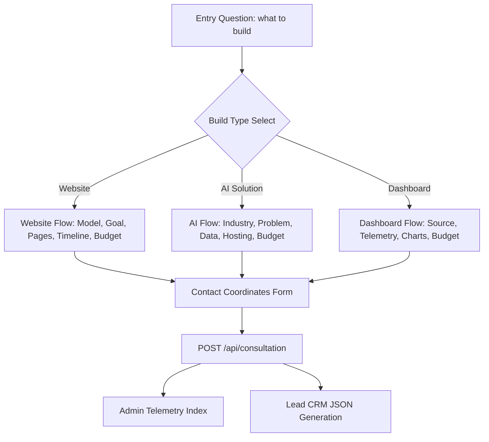

# HawkEdge Discovery Engine Specifications

This document outlines the architecture, logic flows, telemetry calculations, and configuration specs of the **HawkEdge Discovery Engine** (Phase 5).

---

## 1. Overview & Architecture

The Discovery Engine is a customized client-side selector flow mounted under `/contact`. It is designed to capture user scope coordinates, dynamically calculate technical recommendations, render a live project brief, and log structured CRM leads with score metrics.

### Components Ledger:
- `logic.ts`: The central schema containing flow questions, branching rules, scoring metrics, and tech stack generators.
- `DiscoveryEngine.tsx`: The primary questionnaire state machine. Manages keyboard handlers, local storage caches, and split layouts.
- `BriefViewer.tsx`: Specification renderer. Renders dynamic briefs with print CSS overlays.
- `AdminConsole.tsx`: Administrative review panel listing incoming leads, CRM logs, and priorities.
- `route.ts` (`/api/consultation` API): Next.js REST API handling submissions, server validation, console CRM streaming, and in-memory persistence.

---

## 2. Dynamic Question Branching

The engine maps user entry to specific sub-questions:
1. **Website**: Goal -> Audience -> Scope Pages -> CMS & Features -> Launch Date -> Budget.
2. **AI Solution**: Industry -> Problem -> Data State -> VPC/GPU Hosting -> Launch Date -> Budget.
3. **Web Application**: Type -> Concurrency Scale -> Architectural Goal -> Integrations -> DB Isolation Features -> Launch Date -> Budget.
4. **Dashboard**: Source Data -> Telemetry Frequency -> Target Audience -> Charts -> Budget.
5. **Partnership**: Org Type -> Skill verification -> Start cohort -> Candidate Count -> Sponsorship.

---

## 3. Lead Scoring & Priority Formula

Upon completing the contact step, the backend/frontend calculates lead weights:

| Category | Parameter | Score Contribution |
| :--- | :--- | :--- |
| **Budget** | Tier 3 ($100k+, $50k-$100k) | 40 Points |
| | Tier 2 ($25k-$50k, $15k-$30k) | 25 Points |
| | Tier 1 ($5k-$25k) | 15 Points |
| **Timeline** | Immediate (<1m, <2m) | 30 Points |
| | Standard (2-4m) | 20 Points |
| | Exploring / Flexible | 5 Points |
| **Complexity** | AI Solution / Web App (>10k concurrent) | 20 Points |
| | Mobile App / Dashboard (Real-time) | 15 Points |
| | Website / Marketing | 8 Points |
| **Domain Coordinates** | Business Email domain (e.g. non-generic) | 10 Points |
| | Generic email domain (e.g. gmail/yahoo) | 5 Points |

### Priority Thresholds:
- **HIGH PRIORITY**: Score $\ge 70$ (Requires lead architect response within 12 hours).
- **MEDIUM PRIORITY**: Score $40 - 69$.
- **LOW PRIORITY**: Score $< 40$.

---

## 4. Keyboard Navigation Controls

To meet our Lighthouse Accessibility targets, the question engine supports native keyboard shortcuts (active only when focus is outside text input controls):
- **Numbers `[1 - 9]`**: Select corresponding options in select lists immediately.
- **`[ENTER]`**: Submit text field inputs, multi-select sets, or move forward.
- **`[BACKSPACE]`**: Revert to the previous question step, restoring its state.
- **`[TAB]`**: Accessible focus indicators highlighting layout boundaries.

---

## 5. CSS Print Blueprint

Clicking "Download PDF Brief" calls the browser `window.print()` dialog. The brief includes customized media stylesheets:
- Hides headers, navigation links, footers, and administrative selectors.
- Forces high-contrast black text on a clean white background.
- Adjusts padding grids to fit standard A4 paper dimensions without visual content clipping.
